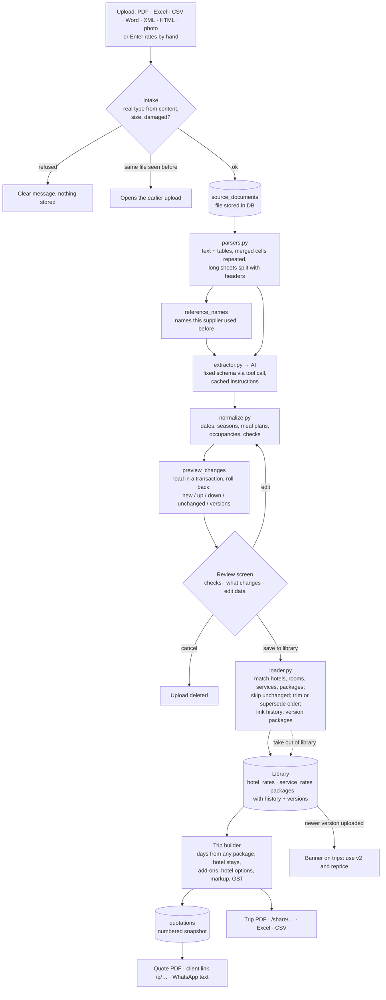
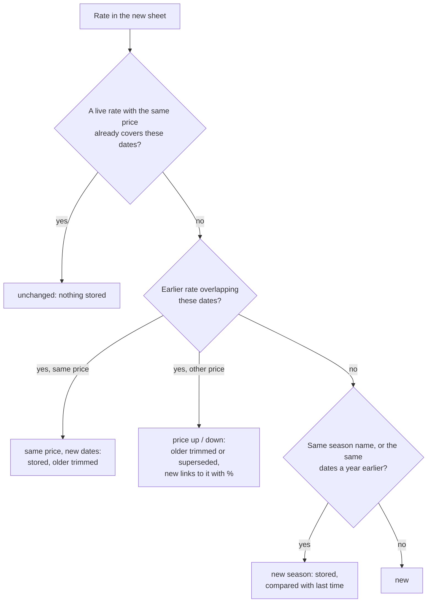
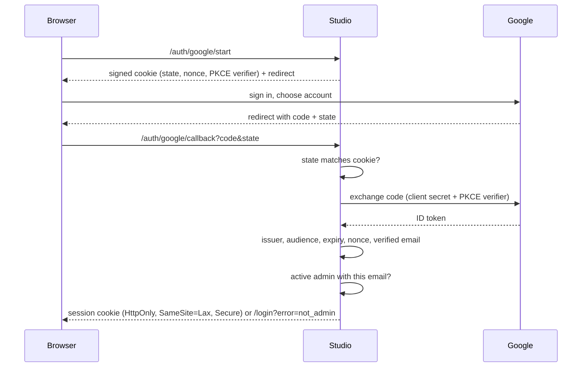

# 8 · Architecture & data flow

The diagrams below are Mermaid; GitHub and most editors draw them. The same diagrams are in the project write-up.

## Architecture

```mermaid
flowchart LR
  subgraph Users
    A[Admins' browsers<br/>index.html + 4 JS files<br/>no build step]
    C[Customer's phone<br/>client link]
    G[Google<br/>OpenID Connect]
  end
  subgraph Vercel["Vercel · Mumbai (bom1)"]
    direction TB
    MW[observe: request id, logs,<br/>security headers, safe 500s]
    AU[require_sign_in: session cookie,<br/>CSRF header, API key]
    API[FastAPI routes<br/>api.py]
    ING[Ingestion<br/>parsers → extractor → normalize → loader]
    BIZ[Library & sales<br/>catalog · history · rates · trips · quotes]
    OUT[Output<br/>pdfgen · sharepage · exports]
    MW --> AU --> API
    API --> ING & BIZ & OUT
  end
  DB[(PostgreSQL · Supabase Mumbai<br/>rates + history, packages + versions,<br/>trips, quotations, users, settings,<br/>files, AI usage)]
  AI[AI provider<br/>Claude by default<br/>or any OpenAI-compatible]
  CRON[Vercel cron<br/>daily 03:00 IST]
  A -- HTTPS --> MW
  C -- HTTPS /share /q --> MW
  A -. sign in .-> G -. code .-> MW
  ING -- document text / images only --> AI
  API <-- SQL (transaction pooler 6543, SSL) --> DB
  CRON -- Bearer CRON_SECRET --> MW
```

- **Backend:** Python 3.11+, FastAPI, SQLAlchemy 2, Alembic, psycopg 3; pdfplumber, openpyxl, xlrd, python-docx, defusedxml for reading files; reportlab for PDFs.
- **Frontend:** `app/static/index.html` with plain JavaScript: `app.js` (pages), `review.js` (document review and editor), `quotes.js` (quotations, hotel options), `history.js` (rate history charts, suppliers). Served by the same app, with no framework and no build step.
- **Database:** PostgreSQL only. Tables are in `app/db.py`; changes go through `app/migrations/` and run on start.
- **AI:** only for reading documents. It never sees customers, trips, payments or users.

## Data flow: from a supplier's file to a customer's quotation

## How a re-uploaded rate is decided

For every rate in the new sheet (hotel: room + meal plan + occupancy + days + net/rack; add-on: supplier + kind + vehicle + basis + similar name):

Packages: same supplier, same nights, similar name once season and year words are removed (the AI's *base name* helps), and overlapping places, means the next **version** of that family. A version whose dates the new one covers becomes *replaced*; an edition for other dates stays live. Where editions overlap, the newest is used for those dates. The reviewer can override the match.

## Sign-in flow

## Code map

| File | Responsibility |
|---|---|
| `app/api.py` | Every URL: pages, JSON API, sign-in gate, logging and security middleware, downloads, share and quotation pages, the cron job |
| `app/auth.py`, `app/google_auth.py` | Passwords, sessions, lockout, users; Google sign-in |
| `app/logs.py` | Log format, request ids |
| `app/db.py` | Tables; engine (pooler, SSL); migrations on start; Supabase Data API lock |
| `app/config.py` | Server settings from `.env` |
| `app/runtime.py`, `company.py`, `ai.py`, `secretbox.py` | Settings saved from the UI; AI connector; key encryption |
| `app/parsers.py` | Any file → text and tables |
| `app/schema.py`, `extractor.py` | The AI contract; Claude and OpenAI-compatible clients, prompts, caching |
| `app/normalize.py` | Cleaning and checks |
| `app/loader.py` | Matching, re-upload decisions, versions, change log, preview, undo |
| `app/pipeline.py` | Upload → read → review → approve / cancel / undo; manual entry |
| `app/history.py` | Rate states, hotel history, package versions, recent changes |
| `app/catalog.py`, `rates.py` | Browsing, search, stay and package pricing, corrections, suppliers and merging |
| `app/trips.py`, `quotes.py` | Trips, hotel options, templates, version upgrades; quotations |
| `app/pdfgen.py`, `sharepage.py`, `exports.py` | PDFs, client pages, CSV / Excel |
| `app/static/` | Web app, sign-in page, brand assets |
| `tests/` | 130+ tests on PostgreSQL (also through a transaction pooler); `tests/browser/` = real-browser run |

## Should the frontend use a framework (React, Vue, Svelte…)?

**Short answer: not now. The current stack is the right size for this app.**

**What the current approach gives you:**

- **Nothing to build.** Deploys are `git push`. There's no Node.js, npm, bundler or `node_modules` to maintain.
- **Small and fast.** About 60 KB gzipped in total, which loads quickly on a phone over 4G.
- **One project.** Frontend and backend live together, deploy together, and share one sign-in cookie. No CORS and no second hosting setup.
- **Easy to change.** Each screen is one function: `pageHome`, `drawTrip`, `drawReview`, `pageQuotes`, `showSupplier`…

**What a framework would cost today:**

- A rewrite of about 1,800 lines, roughly 2 weeks, for the same features.
- A Node toolchain, a build step on every deploy, and dependency upgrades to keep up with.
- 40–150 KB of framework code before any features.

**When it becomes worth it.** Revisit if two or more of these become true:

| Signal | Why a framework helps then |
|---|---|
| `app.js` grows past about 4–5k lines, or several people edit the UI at once | Components and types keep a large UI manageable |
| You need rich interactions: drag-and-drop itinerary builders, live collaboration, offline use | Frameworks and their libraries do these well |
| You want a customer-facing booking site or mobile app sharing UI with the Studio | Shared components pay off |
| You hire a frontend developer who works in a framework | Use what they know |

**If you move, how:**

- Keep FastAPI as the API; the API doesn't change at all.
- Build the new UI with **React + Vite** or **SvelteKit** in static mode.
- Serve its built files from the same app (or the same Vercel project), so sign-in and cookies work unchanged.
- Migrate one screen at a time.
- Avoid a framework that needs its own server (such as Next.js server-side rendering). The backend here is Python, and a second server adds cost and complexity for no gain.

**Already done as a middle step:** the UI is split by area (`app.js`, `review.js`, `quotes.js`, `history.js`). Native ES modules (`<script type="module">`) would be the next step, still without a build.

## Extending the app

- **New feature with new data:**
  1. Add the table or column in `app/db.py`.
  2. Run `alembic revision --autogenerate -m "..."`.
  3. Add the logic in a module, the route in `api.py`, and the screen in `app.js`.
  4. Add a test in `tests/`.
- **New AI provider:** anything OpenAI-compatible works through *Other* in Settings with no code. For a provider with its own API, add a class next to `ClaudeExtractor` in `extractor.py`, register it in `PROVIDERS` in `ai.py`, and choose it in `build_extractor`.
- **Calling the Studio from your website:** set `API_KEY`, then call `/api/...` from your website's **server** with the header `X-API-Key`. Set `ENABLE_API_DOCS=true` to browse every endpoint at `/api/docs` (admins only).
